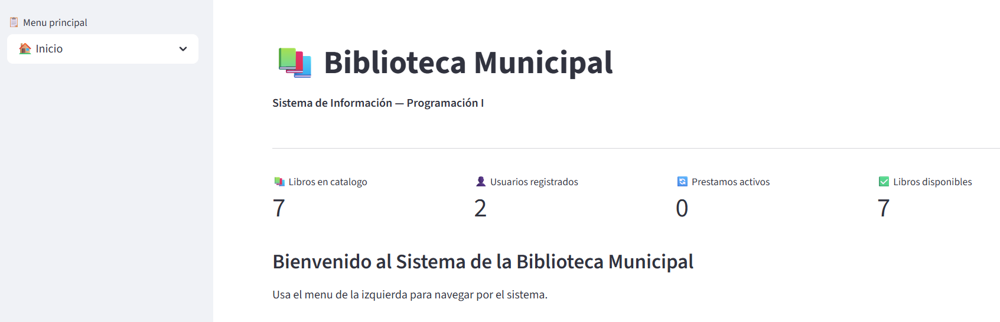
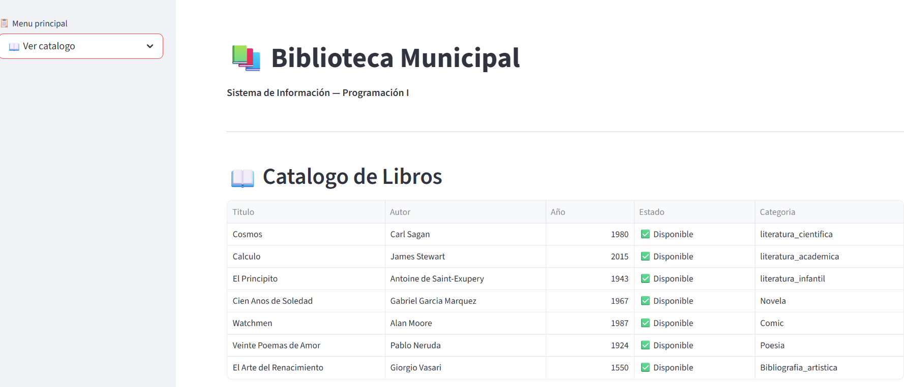
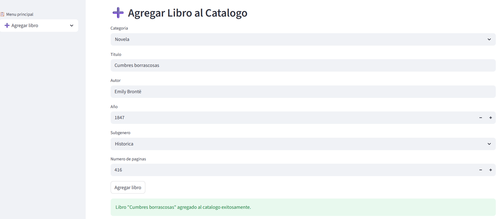
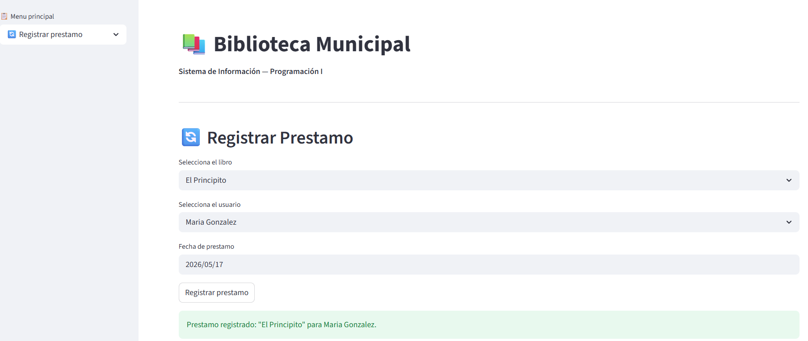
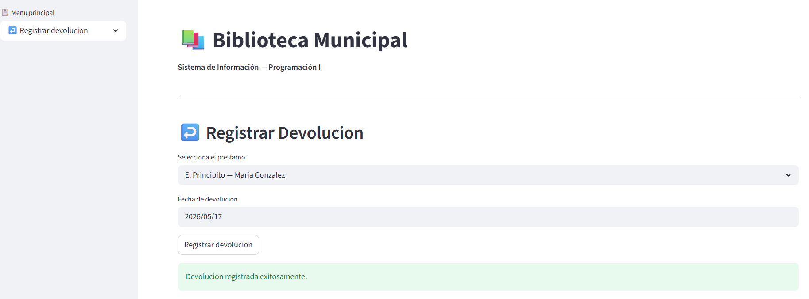
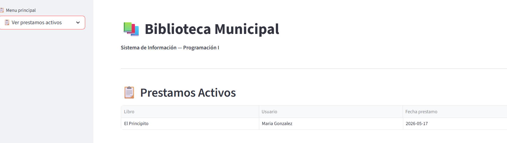
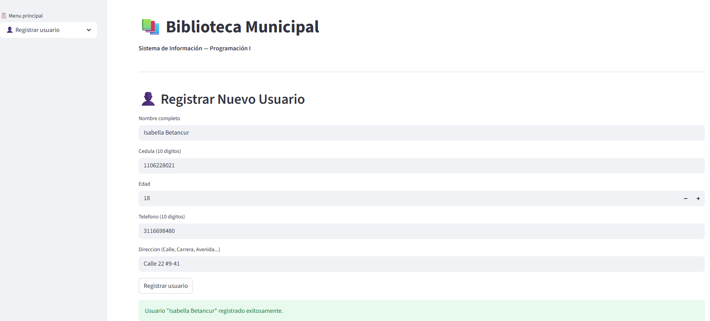
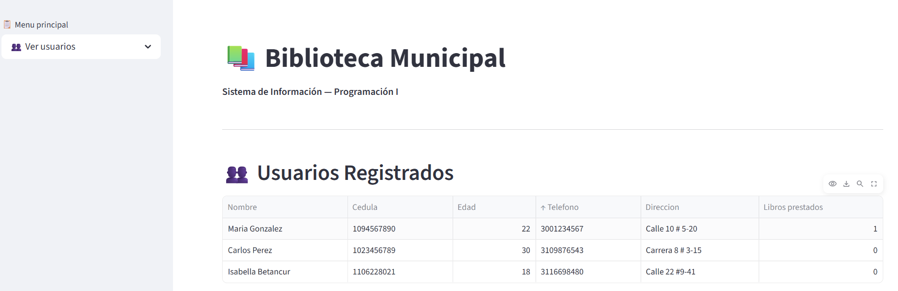
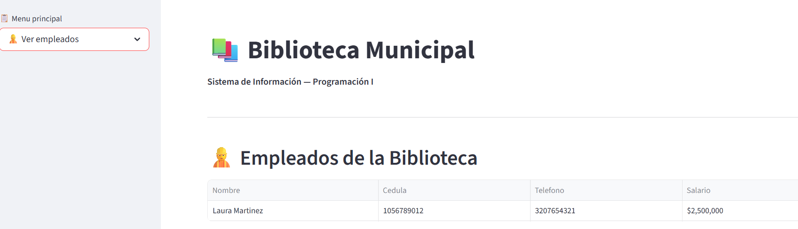
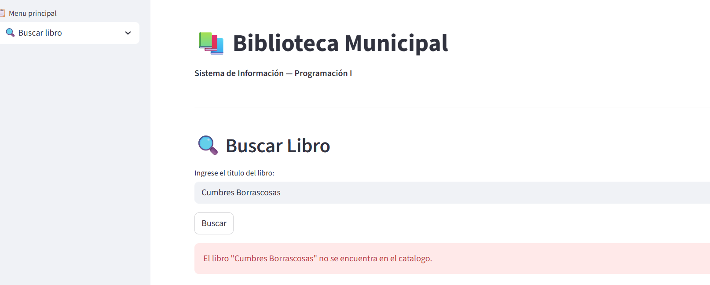

# 📚 Sistema de Información — Biblioteca Municipal
**Proyecto final: Sistema de información**

Sistema de gestión para una biblioteca municipal desarrollado en Python, 
aplicando los conceptos de Programación Orientada a Objetos (POO).

---


---

## 1. 📝 Introducción

Este proyecto corresponde al proyecto final de la asignatura Programación I. Consiste en el diseño e implementación de un Sistema de Información para la gestión de una Biblioteca Municipal, desarrollado en Python aplicando los principios de la Programación Orientada a Objetos (POO).

El sistema permite gestionar el catálogo de libros organizados por categorías, registrar usuarios, administrar préstamos y devoluciones, y gestionar el personal de la biblioteca. Cuenta con un menú interactivo en consola y una aplicación web desarrollada con Streamlit.

---

## 2. 📖 Descripción del Sistema

El sistema está compuesto por tres módulos principales:

**Módulo de Libros:** gestiona el catálogo de libros en 7 categorías: Literatura Científica, Literatura Académica, Literatura Infantil, Novela, Cómic, Poesía y Bibliografía Artística. Cada categoría hereda los atributos básicos de la clase `Libro` y agrega sus propios atributos específicos.

**Módulo de Usuarios y Empleados:** permite registrar usuarios con datos completos (nombre, cédula, edad, teléfono y dirección), consultar su información y ver los libros que tienen prestados. También gestiona los empleados de la biblioteca.

**Módulo de Servicios:** controla préstamos y devoluciones, gestiona el catálogo completo y administra el personal. Cuenta con validaciones y excepciones personalizadas para garantizar la integridad de los datos.

---

## 3. 🖥️ Vista de la Aplicación

### 🏠 Inicio


### 📖 Catálogo de Libros


### ➕ Agregar Libro


### 🔄 Registrar Préstamo


### ↩️ Registrar Devolución


### 📋 Préstamos Activos


### 👤 Registrar Usuario


### 👥 Ver Usuarios


### 👷 Ver Empleados


### 🔍 Buscar Libro


---

## 4. 📂 Estructura del Proyecto

```bash
proyecto_final_Sistema_de_Informacion/
│
└── biblioteca/
    ├── modelos/
    │   ├── libros/
    │   │   ├── libro.py                  # Clase madre
    │   │   ├── literatura_cientifica.py  # Herencia
    │   │   ├── literatura_academica.py   # Herencia
    │   │   ├── literatura_infantil.py    # Herencia
    │   │   ├── novela.py                 # Herencia
    │   │   ├── comic.py                  # Herencia
    │   │   ├── poesia.py                 # Herencia
    │   │   └── bibliografia_artistica.py # Herencia
    │   ├── usuario.py
    │   └── empleado.py
    ├── servicios/
    │   ├── catalogo.py
    │   ├── prestamo.py
    │   └── gestion_empleados.py
    ├── excepciones/
    │   ├── validaciones.py
    │   └── excepciones.py
    ├── Capturas_app/
    ├── app.py
    └── main.py
```

---

## 5. 🧠 Conceptos de POO Aplicados

### 5.1 Clases y Atributos
Una clase es el molde o plantilla que define los atributos y métodos de un objeto.

| Clase | Atributos | Descripción |
|---|---|---|
| `Libro` | titulo, autor, año, disponible | Clase madre de todos los libros |
| `Usuario` | nombre, cedula, edad, telefono, direccion | Persona que usa la biblioteca |
| `Empleado` | nombre, cedula, telefono, salario | Personal de la biblioteca |
| `Catalogo` | libros | Contiene todos los libros |
| `Prestamo` | usuario, libro, fecha_prestamo | Registro de un préstamo |

### 5.2 Método Constructor
El método constructor `__init__` se ejecuta automáticamente al crear un objeto y obliga a que siempre tenga todos sus datos desde el principio.

```python
def __init__(self, titulo: str, autor: str, año: int):
    self.__titulo     = titulo
    self.__autor      = autor
    self.__año        = año
    self.__disponible = True
```

### 5.3 Encapsulamiento
El encapsulamiento protege los atributos de una clase usando doble guion bajo (`__`), de modo que no puedan ser modificados directamente desde afuera. Para acceder a ellos se usan métodos getters y setters.

```python
# Getter: obtiene el valor del atributo privado
def get_titulo(self) -> str:
    return self.__titulo

# Setter: modifica el valor del atributo privado
def set_disponible(self, disponible: bool):
    self.__disponible = disponible
```

### 5.4 Métodos
Los métodos son las acciones que puede realizar un objeto.

- `prestar()`: verifica disponibilidad y presta el libro.
- `devolver()`: marca el libro como disponible nuevamente.
- `mostrar_info()`: muestra la información del objeto.
- `agregar_libro()`: agrega un libro al catálogo.
- `eliminar_libro()`: elimina un libro del catálogo.
- `buscar_libro()`: busca un libro por título.

### 5.5 Herencia
La herencia permite que una clase hija herede todos los atributos y métodos de una clase madre. Las 7 categorías de libros heredan de la clase `Libro`.

```python
# Libro es la clase madre
class literatura_cientifica(Libro):
    def __init__(self, titulo, autor, año, area_ciencia, nivel):
        super().__init__(titulo, autor, año)  # llama al constructor madre
        self.__area_ciencia = area_ciencia
        self.__nivel        = nivel
```

| Clase Madre | Clase Hija | Atributos Propios |
|---|---|---|
| `Libro` | `literatura_cientifica` | area_ciencia, nivel |
| `Libro` | `literatura_academica` | materia, nivel_educativo |
| `Libro` | `literatura_infantil` | edad_recomendada, ilustrado |
| `Libro` | `novela` | subgenero, num_paginas |
| `Libro` | `comic` | editorial, numero_edicion |
| `Libro` | `poesia` | estilo, num_poemas |
| `Libro` | `bibliografia_artistica` | tipo_arte, tecnica |

### 5.6 Polimorfismo
El polimorfismo permite que el mismo método se comporte de manera diferente según el tipo de objeto. El método `mostrar_info()` muestra información diferente según la categoría del libro.

```python
# En literatura_cientifica
def mostrar_info(self):
    super().mostrar_info()
    print(f'Categoria: Literatura Cientifica | Area: {self.__area_ciencia}')

# En novela
def mostrar_info(self):
    super().mostrar_info()
    print(f'Categoria: Novela | Subgenero: {self.__subgenero}')
```

### 5.7 Composición
La composición ocurre cuando una clase contiene objetos de otra clase.

- `Catalogo` contiene una lista de objetos `Libro`.
- `Prestamo` contiene un objeto `Usuario` y un objeto `Libro`.
- `GestionEmpleados` contiene una lista de objetos `Empleado`.

```python
class Catalogo:
    def __init__(self):
        self.__libros = []  # lista de objetos Libro
```

### 5.8 Excepciones y Validaciones
El sistema implementa excepciones personalizadas para manejar los errores posibles:

- `LibroNoDisponibleError`: cuando el libro ya está prestado.
- `LibroNoEncontradoError`: cuando el libro no existe en el catálogo.
- `UsuarioNoEncontradoError`: cuando el usuario no está registrado.
- `UsuarioYaExisteError`: cuando el usuario ya está registrado.
- `PrestamoMaximoError`: cuando el usuario supera el límite de libros.

Funciones de validación:

- `validar_nombre()`: verifica que tenga nombre y apellido completos.
- `validar_cedula()`: verifica que tenga exactamente 10 dígitos.
- `validar_telefono()`: verifica que tenga exactamente 10 dígitos.
- `validar_edad()`: verifica que sea un número entre 1 y 120.
- `validar_direccion()`: verifica que contenga calle, carrera, avenida, etc.
- `validar_año()`: verifica que el año sea válido (1800-2026).

---

## 6. ✨ Funcionalidades

| Opción | Descripción | Conceptos aplicados |
|---|---|---|
| 1 | Ver catálogo de libros | Composición, Polimorfismo |
| 2 | Buscar libro | Excepciones |
| 3 | Registrar préstamo | Composición, Excepciones |
| 4 | Registrar devolución | Métodos |
| 5 | Registrar usuario | Validaciones, Instancia |
| 6 | Ver info de usuario | Encapsulamiento |
| 7 | Ver empleados | Composición |
| 8 | Agregar libro al catálogo | Herencia, Instancia |
| 9 | Ver préstamos activos | Composición |
| 10 | Salir | - |

---

## 7. ▶️ Cómo ejecutar

1. Clona el repositorio
2. Abre la carpeta `biblioteca` en la terminal
3. Ejecuta el sistema en consola:
```bash
python main.py
```
4. O ejecuta la aplicación web:
```bash
python -m streamlit run app.py
```

---

## 8. 🏆 Conclusiones

- La **herencia** permitió crear 7 categorías de libros a partir de una clase madre, evitando la repetición de código.
- El **polimorfismo** permitió que el mismo método `mostrar_info()` se comportara diferente según el tipo de libro.
- La **composición** permitió que el catálogo, el préstamo y la gestión de empleados integraran múltiples objetos.
- El **encapsulamiento** garantizó que los atributos de las clases no pudieran ser modificados directamente.
- Las **excepciones y validaciones** aseguraron la integridad de los datos ingresados por el usuario.

---

## 📝 Notas de Desarrollo
* El código sigue los estándares de la asignatura de **Programación I**.
* Se utiliza **Programación Orientada a Objetos (POO)**.
* Se cumplen todos los requisitos del proyecto final.

---

## 👤 Autora
**Isabella Betancur Muñoz**
Ingeniería de Sistemas — Virtual
Programación I — Grupo 2 — Cohorte 261
Universidad de Manizales — 2026

*Facultad de Ciencias e Ingeniería - Universidad de Manizales*
